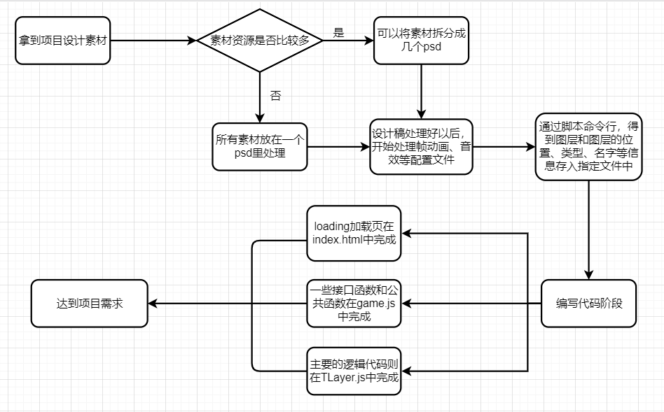
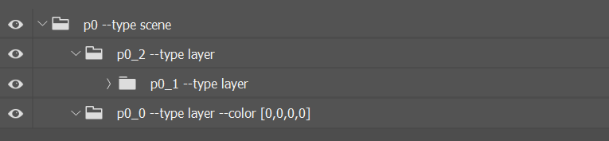
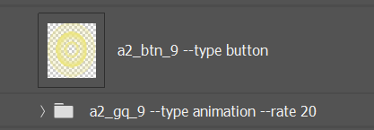
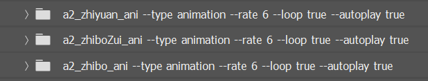

# 长图的开发流程以及技术梳理
<a href="https://m.h5in.net/meituan_test/"></a>
[美团美好生活长卷](https://m.h5in.net/meituan_test/)是我在学习长图项目中用来练手的第一个项目，接下来我将从我的角度出发以这个项目为基础来梳理我对长图项目的制作流程与相关技术点。
***
## 长图H5项目
我所掌握的长图项目是公司基于[cocos](https://www.cocos.com/)所搭建的框架来实现的，主要是通过**html**，**css**和**javascript**等一系列前端语言实现的一个移动端用户长屏H5互动页面。
## 目录
   * [简易开发流程图](#1%E7%AE%80%E6%98%93%E6%93%8D%E4%BD%9C%E6%B5%81%E7%A8%8B%E5%9B%BE)
   * [设计稿处理](#2%E8%AE%BE%E8%AE%A1%E7%A8%BF%E5%A4%84%E7%90%86)
       - [psd目录结构](#1psd%E7%9B%AE%E5%BD%95%E7%BB%93%E6%9E%84)
       - [需分步加载时的psd](#2%E9%9C%80%E5%88%86%E6%AD%A5%E5%8A%A0%E8%BD%BD%E6%97%B6%E7%9A%84psd)
       - [图层命名规范](#3%E5%9B%BE%E5%B1%82%E5%91%BD%E5%90%8D%E8%A7%84%E8%8C%83)
   * [配置文件的规范](#3%E9%85%8D%E7%BD%AE%E6%96%87%E4%BB%B6%E7%9A%84%E8%A7%84%E8%8C%83)
       - [帧动画配置文件（ani_config.js）](#1%E5%B8%A7%E5%8A%A8%E7%94%BB%E9%85%8D%E7%BD%AE%E6%96%87%E4%BB%B6ani_configjs)
       - [音效配置文件（effect_config.js）](#2%E9%9F%B3%E6%95%88%E9%85%8D%E7%BD%AE%E6%96%87%E4%BB%B6effect_configjs)
       - [分步加载配置文件（res_config.js）](#3-%E5%88%86%E6%AD%A5%E5%8A%A0%E8%BD%BD%E9%85%8D%E7%BD%AE%E6%96%87%E4%BB%B6res_configjs)
   * [命令行语句](#4%E5%91%BD%E4%BB%A4%E8%A1%8C%E8%AF%AD%E5%8F%A5)
   * [分步加载](#4%E5%88%86%E6%AD%A5%E5%8A%A0%E8%BD%BD)
   * [代码中的关键文件](#5%E4%BB%A3%E7%A0%81%E4%B8%AD%E7%9A%84%E5%85%B3%E9%94%AE%E6%96%87%E4%BB%B6)
       - [index.html](#1indexhtml)
       - [BaseScene.js](#2basescenejs)
       - [game.js](#3gamejs)
       - [TLayer.js](#4tlayerjs)
## 1、简易操作流程图
下图是我对于长图项目的整体流程的一个简单描述，细节部分请接着往下看。

## 2、设计稿处理
### 1）psd目录结构


**--type scene**  

表示最外层容器，其他所有的长图图层内容都放置于这个容器中，代码框架中也是根据这个**scene**来进行UI部分的页面适配  

**--type layer**  

上图中的`p0_0 --type layer`为一个透明的空白浮层，作为滑动浮层使用  

而`p0_2 --type layer`则是放置内容的图层文件，代表这个文件内的所有图层均处于同一页面上，长图项目则主要就为这一页。  

### 2）需分步加载时的psd
* **game.psd**  放置所有图层，只进行`npm run export2`操作，获取所有图层信息（位置，类型等）
* **game_n.psd**  根据图层的长度均分成n份，放置n份长图的图层，进行`npm run export2000 n`和`npm run pack2000`操作，获取精灵图和背景图（不需要管psd中图层的位置和层级）  

***注意：背景和所有的按钮需要放在一开始就加载的psd中***

### 3）图层命名规范
  
   按钮相关的图层需要在文件名后面加上 **--type button**  
   
  
   帧动画的文件组名需要在名字后面加上 **--type animation**  

   **--rate**后面的数字则是控制一秒内显示的图片数量，后面跟的数字越大，帧动画播放越快；反之，越慢。  
   **--loop**后面的**true**或者**false**则代表帧动画是否需要循环播放，**true**为循环播放，**false**则为只播放一次。  
   **--autoplay**后面的**true**或者**false**则代表的是帧动画是否需要自动播放，**true**为自动播放，**false**则为需要通过事件触发。  
   
## 3、配置文件的规范
### 1）帧动画配置文件（ani_config.js）
```javascript
var anis=[
    [name,left,center,0,0,0,isplayed,isloop,1],
    [name,left,center,0,0,0,isplayed,isloop,1],
    ...
]
```
```text
[name,left(帧动画的top值),center(帧动画的中心位置),0(移动的x),0(移动的y),0(移动的时间),isplayed(是否已经播放过),isloop(是否循环播放),times(如果为非循环的帧动画，需要重复展示帧动画的次数)]
```
### 2）音效配置文件（effect_config.js)
```javascript
var effects=[
    [name,y,y+h,0,null,loop],
    [name,y,y+h,0,null,loop],
    ...
]
```
```text
[name,y（音乐开始播放的y）,y+h（音乐结束播放的y),0,null,isloop(是否循环播放)]
```
### 3) 分步加载配置文件（res_config.js）
```javascript
game.resList=[
    ['1',0,4800,false,8], //fales可以直接改为true
    ['2',500,10000,false,2],
    ['3',2900,14318,false,2]
];
```
```text
123是psd处理时a后面的数字 0，500，2900是指开始加载的位置（提前加载），14318是最大的位置（也就是最后的位置），false代表是否加载过，8，2，2对应精灵图数分别有多少
```
## 4、命令行语句
命令行                | 含义
:-------------------- | :---
npm run export2       | 获取所有图层信息（位置、类型、名字等）
npm run export2000 n  | 获取背景图(n为psd的后缀)
npm run pack2000      | 获取精灵图
npm run compile       | 压缩部署得到game.min.js
npm run upload_cos    | 上传cdn
## 5、分步加载
   在处理图层时需要注意所有元素都需要处理，但是不需要写入信息和打包，背景和所有按钮都放在一开始就加载的**psd**里;  
   将需要分步加载的资源整理分成不同的**psd**文件，然后剩下必须要加载的整合成一个**psd**，处理记录信息，并分开来拼合成精灵图，这样需要使用哪个资源就只需要加载该资源所在的精灵图，剩下来的就不需要加载了;  
   在处理完图层和数据之后要在**config.js**里面把和后面加载的东西一样的部分给删掉，防止预加载;  
   代码部分需要注意,滑动的时候异步加载，通过传参调用**TLayer.js**中封装好的**addElse**函数，实则调用的是**game.js**中的**loadELse**函数。
```javascript
//TLayer.js
addElse: function (num, name, callback) {
    var self = this;
    game['loadElse'](num, name, function (num, name) {
        // console.log(game['resources']['res' + name])
    	cc.loader.load(game['resources']['res' + name],
	function (result, count, loadedCount) {
	    // console.log(result)
	},
	function () {
	    for (var i = 0; i < num; i++) {
		cc.spriteFrameCache.addSpriteFrames(game['baseUrl'] + 'res/' + name + '/GameAssets_' + i + '.plist', game['baseUrl'] + 'res/' + name + '/GameAssets_' + i + '.png');
	    }
	    self.initUI(name);
	    callback && callback()
	});
    })
},
//game.js
loadElse: function (num, name, callback) {
    var g_resources2 = this['resources']['res' + name];
    // console.log(num)
    //加载对应年代的精灵图
    for (var i = 0; i < num; i++) {
        g_resources2.push(game['baseUrl'] + 'res/' + name + '/GameAssets_' + i + '.png')
        g_resources2.push(game['baseUrl'] + 'res/' + name + '/GameAssets_' + i + '.plist')
    }
    // console.log(g_resources2)
    callback && callback(num, name);
},
```
## 6、代码中的关键文件
### 1）index.html
设计实现项目加载页内容和适配原则以及引入原生css文件以及部分需要提前引入的js资源库，下方为简单示例
```html
<link type="text/css" rel="stylesheet" href="css/style.css">
<div id="loading">
  //加载页面的设计与实现
</div>
<script src="libs/Stage.js"></script>
<script src="libs/jquery-2.1.3.min.js"></script>
```
### 2）BaseScene.js
长图最关键的适配原则就放置于这个文件夹中,以下则是实现适配的关键函数
```javascript
resize: function () {
    var w1 = window.innerWidth;
    var h1 = window.innerHeight;
    var w2 = cc.winSize.width; //750
    var h2 = cc.winSize.height; //1240
    var w3 = cc.visibleRect.width;
    var h3 = cc.visibleRect.height;
    var r1 = w1 / h1;
    var s = 1;
    var scale_level = -1;
    if (w1 > h1) {
        s = w3 / 750; //横屏
    } else {
        s = w3 / 750; //竖屏
    }
    this.scale = s;
    return;
}
```
### 3）game.js
在这个文件里则主要放置项目所需的接口函数以及一些功能函数，以下是部分示例代码

***微信端分享部分***
```javascript
setShare: function (title, desc, desc2) {
    var link = h5_config.baseLink + h5_config.para;
    var imgUrl = (h5_config.baseUrl || h5_config.baseLink) + 'images/icon.jpg';
    var success1 = function () {
        game.log('meituan_test', "share_sussess" + "_time");
    };
    var success2 = function () {
        game.log('meituan_test', "share_sussess" + "_friend");
    };
    var cancel = function () {
        game.log('meituan_test', "share_sussess" + "_cancel");
    };
    wx.updateTimelineShareData({
        title: title, // 分享标题
        link: link, // 分享链接，该链接域名或路径必须与当前页面对应的公众号JS安全域名一致
        imgUrl: imgUrl, // 分享图标
        success: success1,
        cancel:cancel
    });
    wx.updateAppMessageShareData({ 
        title: title, // 分享标题
        desc: desc, // 分享描述
        link: link, // 分享链接，该链接域名或路径必须与当前页面对应的公众号JS安全域名一致
        imgUrl: imgUrl, // 分享图标
        success: success2,
        cancel: cancel
    })
}
```
***通过后端给到的接口将图片转化成base64***
```javascript
getBase64:function(data,callback){
    $.get('./api/getBase64/', {
        signature: data.signature,
        timestamp: data.timestamp,
        nonceStr: data.nonceStr,
        ukey:h5_config.ukey,
        url:h5_config.headimgurl
    }, function (res) {
        callback && callback(res);
    }, 'json');
},

```    
### 4）TLayer.js
项目中的逻辑代码部分则主要在这个文件中实现,以下是部分功能函数代码展示。

***实现长图滑动的关键代码函数，具体解释有在代码上进行注释***
```javascript
this.setCallback(
    function (touch, event) {
        // console.log('touch end');
        canAutoScroll = true;
    },
    function (touch, event) {
        var delta = touch.getDelta();
        var nowTime = +new Date();
        if (lastTime) {
            velY = (delta.y / (nowTime - lastTime)) * 1000;
            velY = Math.max(Math.min(velY, 3000), -3000);
        }
        lastTime = nowTime;
        // p0_1.y += delta.y;
        if (game['isMove']) {
            p0_1.moveY(delta.y);//调用case‘p0_1’中定义的moveY函数，并且给它一个delta.y的参数
        }
    },
    function (touch, event) {
        game['isMove'] = true;
    }
);
this.moveY = function (deltaY) {
    //deltay是滑动距离
    //minY为初始y值，maxY为当前能滑动的最大y值
    self.y = Math.min(Math.max(self.y + deltaY, minY), maxY)
    self.percent = (self.y - minY) / (maxY - minY)
    game['nowY'] = self.y
    //game['nowY']及时存储滑动到哪了
    checkY(self.y, self.percent)
    // console.log(self.y,maxY,'y,maxY');
}
```
***长图中的按钮点击与实现***  
   起初在项目图层处理时，需要将每个按钮的图层名称后面加上 **--button**
   然后再通过在**按钮元素.setCallback**的回调函数中控制点击以后触发的事件
```javascript
var item = self.getChildByName(" "); //" "中为图层名
item.setCallback(function () {
 //按钮点击后的一系列事件	    
})
```
***控制帧动画的播放***  
   当识别到长图滑动到某个位置需要播放某个帧动画时，调用**showAni()** 函数
```javascript
self.getChildByName(' ').showAni(); //' '中为帧动画文件组名
//框架BaseAnimationSprite.js文件中
showAni: function (callback) {
    var self = this;
    if (this.loops) {
        this.runAction(
            cc.repeatForever(
                cc.sequence(
                    cc.animate(this['ani'])
                )
            )
        )
    } else {
        this.runAction(
            cc.sequence(
                cc.animate(this['ani']),
                cc.callFunc(function(){
                    callback && callback();
                })
            )
        )
    }
}
```
***控制元素进行动画***  
一个元素依次执行一个或多个动画
```javascript
item.runAction(
    cc.sequence(   //sequence是依次执行
         cc.scaleTo(1,1),   //（时间，最终scale值）先将元素的scale值设为初始需要的值，再运用scaleTo
         cc.callFunc(function(){
            //上方功能函数执行完后，紧接着执行的逻辑代码
         })
    )
)
```  
   一个元素同步执行多个动画
```javascript
item.runAction(
    cc.spawn(    //spqwn是同步执行
        cc.fadeIn(delay), //(秒数)
        cc.moveBy(0.8, _X, 0) //（秒数，x轴移动距离，y轴移动距离）
    )
)
```  
   一个元素反复执行一个动画
```javascript
item.runAction(
    cc.repeatForever(  //repeatForever是一直反复执行
        cc.rotateBy(1.0, 360) //（秒数，转动角度） 一秒转动360度
    )    
)
```  

至此，以上就是我在长图项目的学习过程中，对于长图开发的流程理解以及知识梳理。
